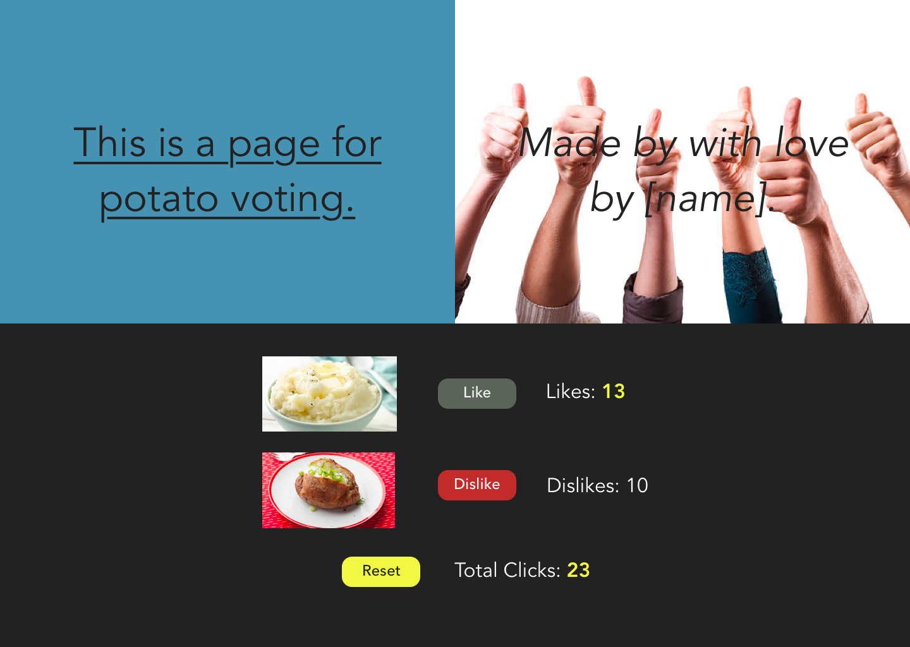
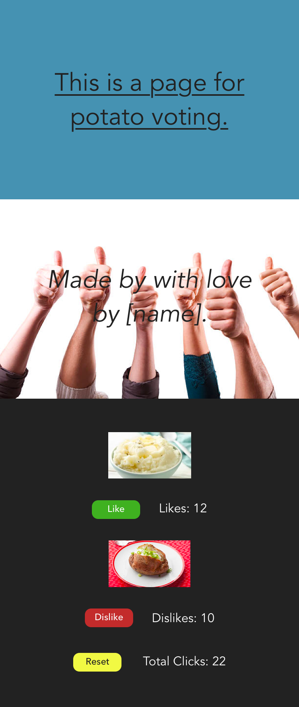

# Front-End Developer Interview Challenge

At Cognite we believe design is a collaborative process between designer and developer.
This goal of this task is to assess your technical skills as a developer, but also your ability to give and accept feedback, and work in a team. Accordingly, you will have access to the designer during the task.

Communicate your thought process while developing and don't be afraid to ask questions. Work with the designer to make the best possible solution to achieve the goal of the application.

Use any online resources you see fit.

## Situation of Concern

A restaurant is having trouble deciding on menu items and understanding the wants of their customers.

## Proposed Solution

An application that allows customers at a restaurant to vote on new menu items.

## Your task

Implement a simple proof-of-concept front-end application based on the design sketches provided by the designer.

The task is designed to be more complex than what can be accomplished in 60 minutes. Do your best to showcase your strengths and prioritise as you see fit.

### Resources

Images and design sketches are located in the resources folder.
Colours are in a comment in `src/App.css`.

#### Desktop

#### Desktop Active

#### Mobile

## Getting Started

This project was generated with [Create React App](https://github.com/facebook/create-react-app). Refer to `docs/create-react-app` to find more information on how to perform common tasks.

### `npm install` or `yarn`

Will get you started by installing all packages. Once the installation is done, you can run some commands inside the project folder:

### `npm start` or `yarn start`

Runs the app in development mode. 
Open [http://localhost:3000](http://localhost:3000) to view it in the browser.

The page will reload if you make edits. 
You will see the build errors and lint warnings in the console.

### `npm test` or `yarn test`

Runs the test watcher in an interactive mode. 
By default, runs tests related to files changes since the last commit.

[Read more about testing.](https://github.com/facebookincubator/create-react-app/blob/master/packages/react-scripts/template/README.md#running-tests)

### `npm run build` or `yarn build`

Builds the app for production to the `build` folder. 
It correctly bundles React in production mode and optimizes the build for the best performance.

The build is minified and the filenames include the hashes. 
Your app is ready to be deployed!

## Good luck! :)
