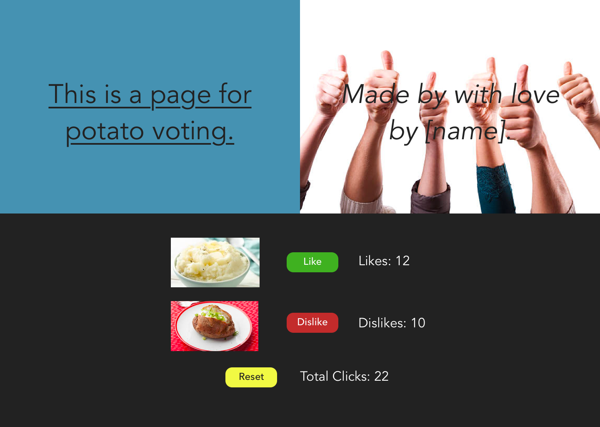
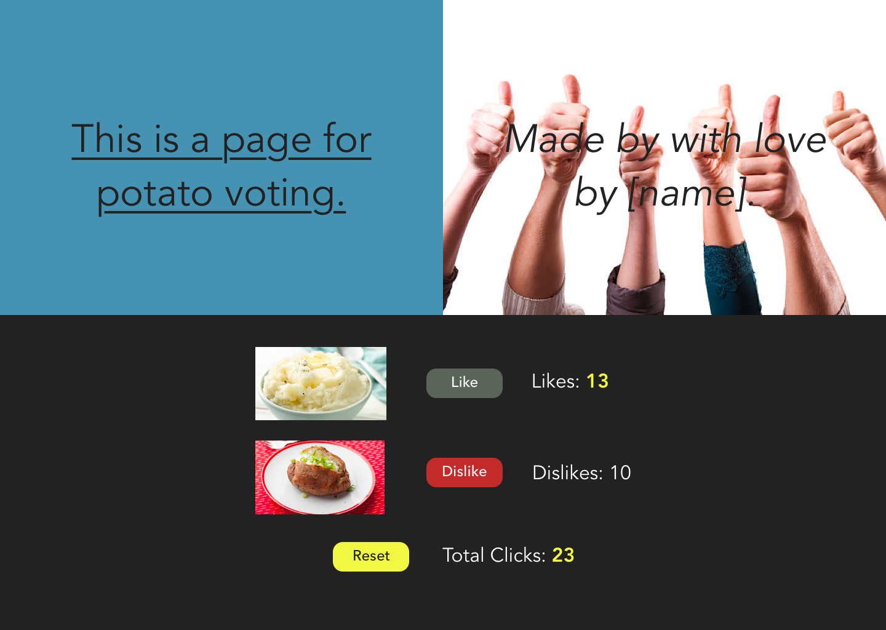
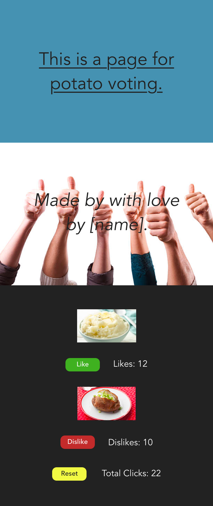

# Front-End Developer Interview Challenge

At Cognite we believe design is a collaborative process between designer and developer.
This goal of this task is to assess your technical skills as a developer, but also your ability to give and accept feedback, and work in a team. Accordingly, you will have access to the designer during the task.

Communicate your thought process while developing and don't be afraid to ask questions. Work with the designer to make the best possible solution to achieve the goal of the application.

Use any online resources you see fit.

## Situation of Concern

A restaurant is having trouble deciding on menu items and understanding the wants of their customers.

## Proposed Solution

An application that allows customers at a restaurant to vote on new menu items.

## Your task

Implement a simple proof-of-concept front-end application based on the designs sketches provided by the designer.

The task is designed to be more complex than what can be accomplished in 60 minutes. Do your best to showcase your strengths and prioritise as you see fit.

### Resources

Images and design sketches are located in the resources folder.
Colours are in a comment in `src/App.css`.

#### Desktop

#### Desktop Active

#### Mobile

Good luck! :)
